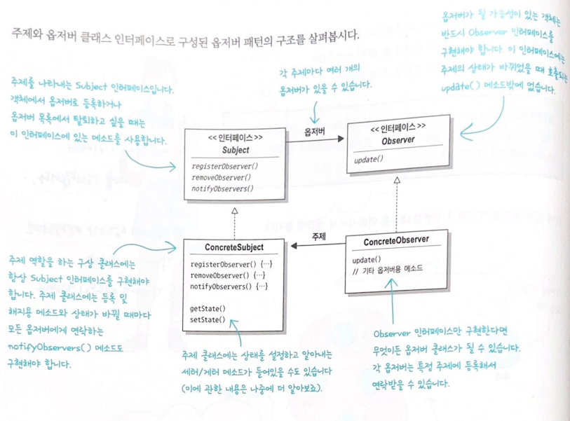
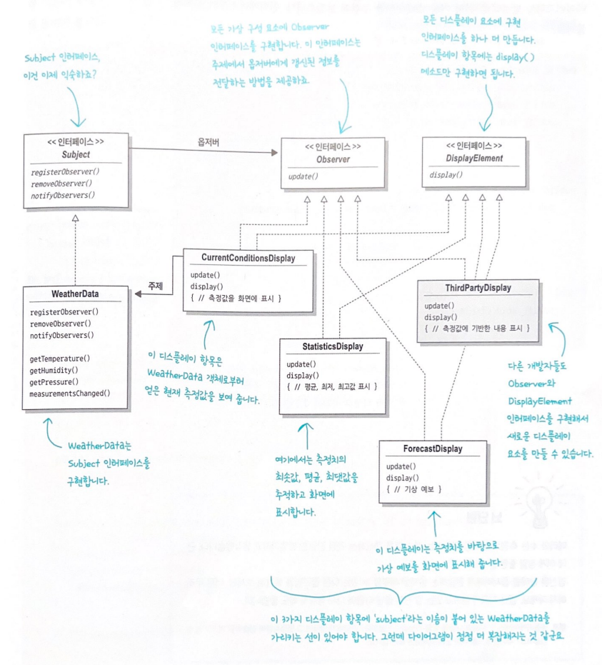
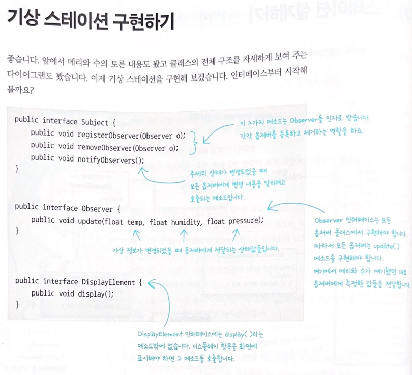
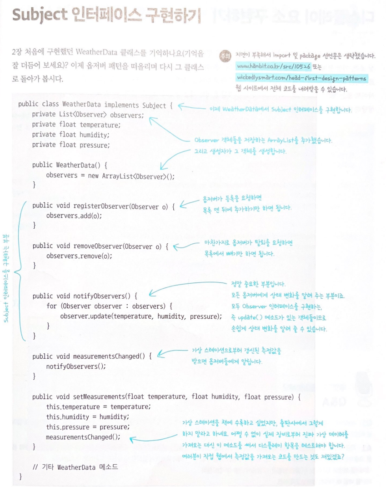
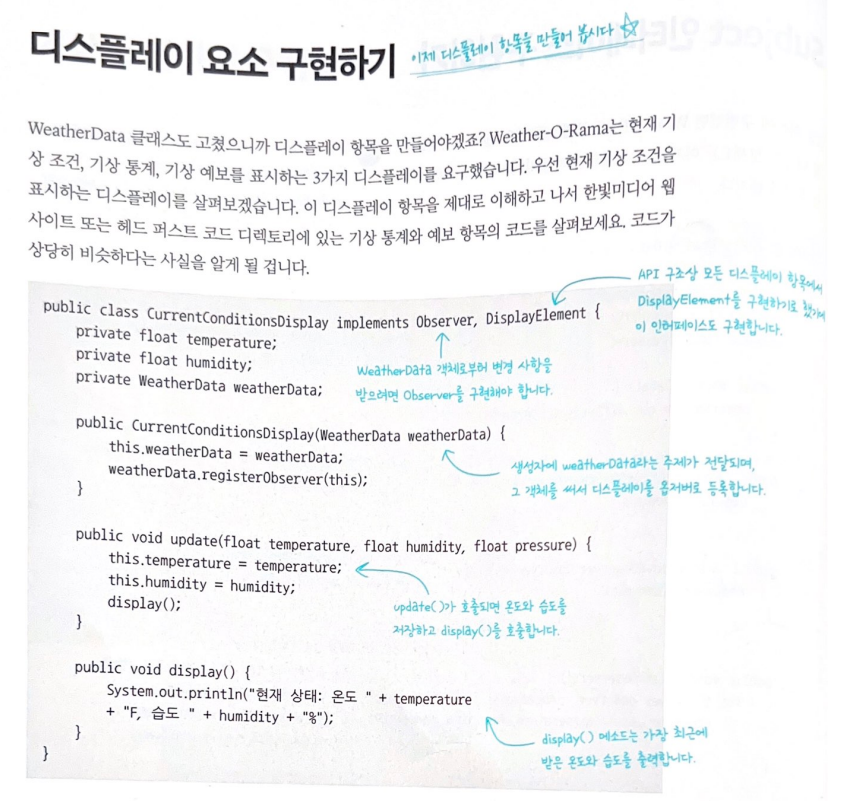
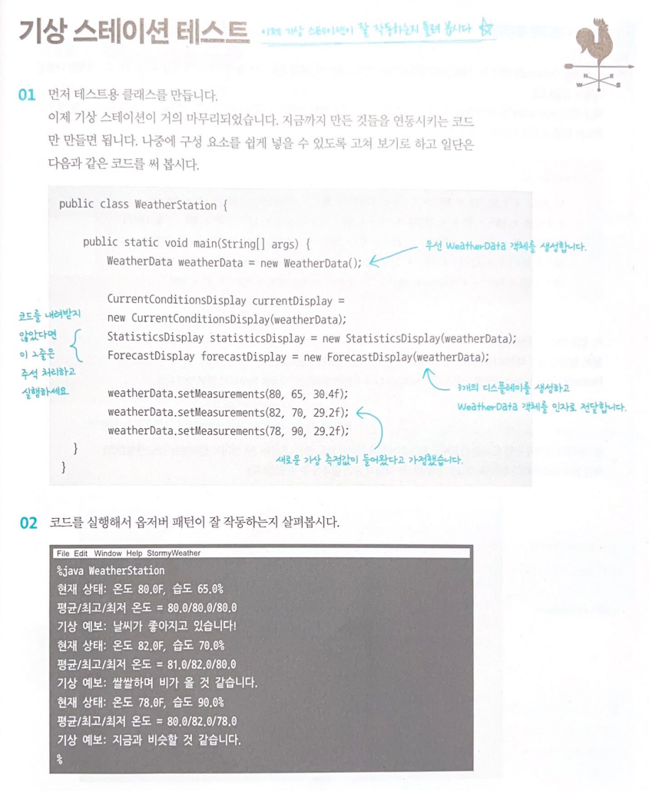

# 챕터 2. 옵저버패턴

## 옵저버 패턴 이해하기
한마디로 객채들에게 연락돌리기
```
신문사 (주제; Subject) + 구독자 (옵저버; Observer) = 옵저버 패턴
```
1. 신문사가 사업을 시작하고 신문을 찍어내기 시작한다.
2. 독자가 특정 신문사에 구독 신청을 하면 매번 새로운 신문이 나올 때마다 배달을 받을 수 있다. 구독을 해지하기 전 까지 신문을 계속받을 수 있다.
3. 신문을 더 이상 보고 싶지 않으면 구독해지를 신청한다. 그러면 더이상 신문이 오지않는다.
4. 신문사가 망하지 않는 이상 개인, 호텔, 항공사 및 기타 회사 등은 꾸준하게 신문을 구독하거나 해지한다.

## 옵저버 패턴의 정의
**옵저버 패턴(Observer Pattern)** 은 한 객체의 상태가 바뀌면 그 객체에 의존하는 다른 객체에게 연락이 가고 자동으로 내용이 갱신되는 방식으로 일대다(One to Many)의존성을 정의한다.

## 옵저버 패턴의 구조
### 구현목표
```
디스플레이를 구현하고 새로운 값이 들어올 때마다, 즉 measurementsChanged()메소드가 호출될 때마다 WeatherData에서 디스플레이를 업데이트.
```
### 조건
```
- WeatherData 클래스에는 3가지 측정값 (온도, 습도, 기압)의 게터 메소드
- 새로운 기상측정 데이터가 들어올때마다 measurementsChanged() 메소드 호출
- 기상 데이터를 사용하는 디스플레이 요소 3가지를 구현해야 함 (현재 조건 디스플레이, 기상통계 디스플레이, 기상예보 디스플레이). 이때 새로운 측정값이 들어올 때마다 디스플레이를 갱신해야 함.
- 디스플레이를 업데이트 하도록 measurementsChanged() 메소드에 코드추가
```








### Key Point
- 전략패턴에서 이야기 했듯이 변하는 것과 변하기 않는 것으로 먼저 나누어서 생각하기
- 옵저버 패턴에서 변하는 것은 주제의 상태와 옵저버의 개수, 형식 -> 바뀌는 부분은 캡슐화
- 상속보다는 구성을 활용하자!
- 구현보다는 인터페이스에 맞추어서 프로그래밍!
- 공통적으로 옵저버 패턴에서는 주제와 옵저버에 다음과 같은 메소드가 존재하도록 구성하기

||주제|옵저버|
|:---|:---|:---|
|메서드|- 옵저버등록(register) <br> - 옵저버삭제 (remove) <br> - 옵저버에게 상태알림(notify) |주제에서 옵저버에게 갱신된 정보를 전달하기 위한 메서드(update) |

### 느슨한 결합
**객체들이 상호작용 할 수는 있지만, 서로를 잘 모르는 관계를 의미**
- 왜 옵저버 패턴이 느슨한 결합인가?
1. 주제는 옵저버가 특정 인터페이스를 구현한다는 사실만 알기때문에
2. 새로운 형식의 옵저버를 추가할 때도 주제변경 필요 전혀없음.
3. 주제와 옵저버는 서로 독립적으로 재사용 가능
4. 주제나 옵저버가 달라져도 서로에게 영향을 미치지 않음
```
즉, 느슨하게 결합하는 디자인을 사용하면 변경사항이 생겨도 무난히 처리할 수 있는 유연한 객체지향 시스템을 구축할 수 있다. 왜? 객체 사이의 상호의존성을 최소화 할 수 있기 때문!
```

### 풀 방식으로 코드변경
- 옵저버로 데이터를 보내는 푸시(push)를 사용하거나 옵저버가 주제로부터 데이터를 당겨오는 풀(pull)을 사용하는 구현방법이 존재
- 푸시; 주제가 옵저버에게 상태를 알리는 방식
- 풀; 옵저버가 주제로부터 상태를 끌어오는 방식
```
푸시방법보다 풀 방법으로 옵저버 패턴을 구현하는 것이 확장성면에서 친화적이다.
```

#### 어떻게 바꿔?
- 주제의 게터메서드를 추가하여 옵저버에서 상태끌어오기
- 기존 푸시방법에서 update 메서드에 인자가 존재했다면 풀방법에서는 인자없이 호출하도록 변경


### 예시
#### 옵저버패턴 in 파이썬 딥러닝 학습관련 코드
1. 모델 체크포인트 저장: 옵저버 패턴을 사용하여 주기적으로 모델의 가중치를 저장. 학습 중간에 모델의 성능이 향상되면 해당 시점의 모델 상태를 저장하여 학습 중단 시에 이어서 학습이 가능.

2. 학습 곡선 모니터링: 옵저버를 사용하여 학습 과정 동안 손실 함수 값의 변화나 정확도 등의 지표를 실시간으로 모니터링 가능. 이를 통해 학습 진행 상황을 시각화하고 문제가 발생하면 조치를 취할 수 있음.

3. 자동 학습 중단: 특정 조건을 충족할 때 학습을 중단하는 기능을 구현가능. 예를 들어, 검증 손실이 더 이상 감소하지 않을 때 학습을 자동으로 중단하는 것이 가능.

4. 활성화 맵 시각화: CNN (Convolutional Neural Network)과 같은 모델에서는 중간 층의 활성화 맵을 시각화하면 모델이 이미지를 어떻게 이해하고 있는지 이해할 수 있음. 이를 옵저버 패턴으로 구현하여 학습 중에 중간 층의 활성화를 저장하고 시각화 가능.

5. 특징 추출: 전이 학습을 위해 모델의 중간 층의 출력을 추출하고 다른 모델에 입력으로 사용할 수 있음. 이를 통해 한 모델에서 학습한 특징을 다른 모델에 재활용

#### 파이썬 옵저버 패턴
- Subject 클래스는 옵저버들을 관리하고 attach, detach, notify 메서드를 제공하여 옵저버 패턴을 구현
- Observer 클래스는 이벤트를 수신하고 처리하는 역할

```python
# 주제(Subject) 클래스
class Subject:
    def __init__(self):
        self._observers = []  # 옵저버들을 저장할 리스트

    def attach(self, observer):
        # 옵저버를 추가
        if observer not in self._observers:
            self._observers.append(observer)

    def detach(self, observer):
        # 옵저버를 제거
        try:
            self._observers.remove(observer)
        except ValueError:
            pass

    def notify(self, message):
        # 주제에서 발생한 이벤트를 옵저버들에게 알림
        for observer in self._observers:
            observer.update(message)

# 관찰자(Observer) 클래스
class Observer:
    def update(self, message):
        # 이벤트를 받아 처리
        print(f"Received message: {message}")

# 예제 실행
if __name__ == "__main__":
    subject = Subject()  # 주제 생성
    observer1 = Observer()  # 옵저버 1 생성
    observer2 = Observer()  # 옵저버 2 생성

    subject.attach(observer1)  # 옵저버 1을 주제에 연결
    subject.attach(observer2)  # 옵저버 2를 주제에 연결

    subject.notify("Hello, observers!")  # 주제에서 이벤트 발생
```

#### 모델학습과정 모니터링 및 중간결과 관찰을 위한 학습손실 (loss) 모니터링을 위한 옵저버 패턴
- TrainingSubject 클래스가 옵저버 패턴의 주제 역할을 하고, LossObserver 클래스가 손실을 관찰하는 역할
- 학습 과정에서 주기적으로 손실을 notify 메서드를 통해 옵저버에게 전달하고, LossObserver는 이를 받아 출력
```python
import torch
import torch.nn as nn
import torch.optim as optim

# 주제(Subject) 클래스
class TrainingSubject:
    def __init__(self):
        self._observers = []  # 옵저버들을 저장할 리스트

    def attach(self, observer):
        # 옵저버를 추가
        if observer not in self._observers:
            self._observers.append(observer)

    def detach(self, observer):
        # 옵저버를 제거
        try:
            self._observers.remove(observer)
        except ValueError:
            pass

    def notify(self, loss):
        # 주제에서 발생한 이벤트(여기서는 손실)를 옵저버들에게 알림
        for observer in self._observers:
            observer.update(loss)

# 관찰자(Observer) 클래스
class LossObserver:
    def update(self, loss):
        # 손실을 받아 처리
        print(f"Received loss: {loss}")

# 간단한 모델 정의
class SimpleModel(nn.Module):
    def __init__(self):
        super(SimpleModel, self).__init__()
        self.fc = nn.Linear(2, 1)

    def forward(self, x):
        return self.fc(x)

# 데이터 및 모델 설정
data = torch.randn(100, 2)
target = torch.randn(100, 1)
model = SimpleModel()
criterion = nn.MSELoss()
optimizer = optim.SGD(model.parameters(), lr=0.01)

# 주제 생성 및 옵저버 연결
training_subject = TrainingSubject()
loss_observer = LossObserver()
training_subject.attach(loss_observer)

# 학습 루프
for epoch in range(10):
    optimizer.zero_grad()
    outputs = model(data)
    loss = criterion(outputs, target)
    loss.backward()
    optimizer.step()

    # 학습 주기마다 손실을 옵저버에게 알림
    training_subject.notify(loss.item())
```