# 챕터 4. 팩토리 패턴

## 팩토리 패턴?
공장과 제품의 관계, 다양한 공장에서 다양한 제품을 만들때 사용하는 패턴
1. 객체를 생성할 때 필요한 인터페이스를 만든다.
2. 어떤 클래스의 인스턴스를 만들지는 서브클래스에서 결정한다.
3. 클래스 인스턴스 만드는 일을 서브클래스에게 맡긴다.


## 예를들어
- 우리가 피자가게를 운영해본다고 하자
=> 피자 종류가 하나만 있는 건 아니지? 그래서 피자종류를 파탕으로 인스턴스 생성하는 orderPizza 메소드를 정의

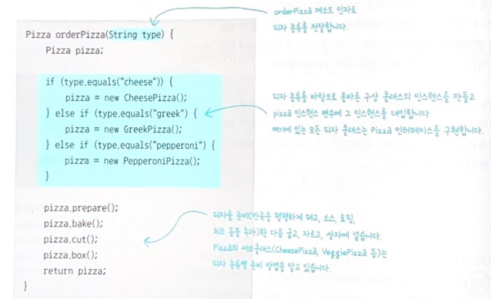

- 하지만 신메뉴를 추가하거나 메뉴를 없앤다면 우리는 다음과 같이 코드를 변경할 것 => 이는 OCP 법칙을 위배 

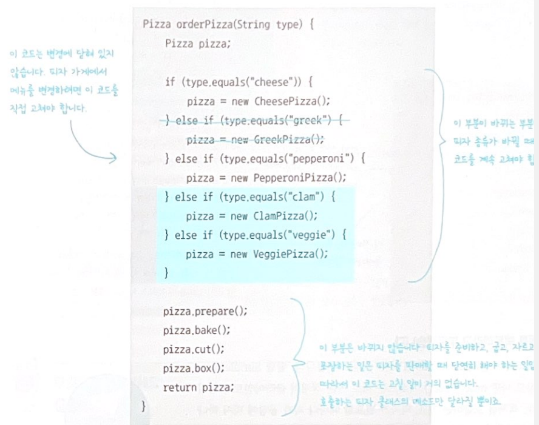

- 그리하여 OrderPizza() 메소드에서 가장 문제가 되는 부분은 <인스턴스를 만드는 구상클래스를 선택하는 부분> => 다음과 같이 피자 객체생성 부분을 전담할 클래스를 정의

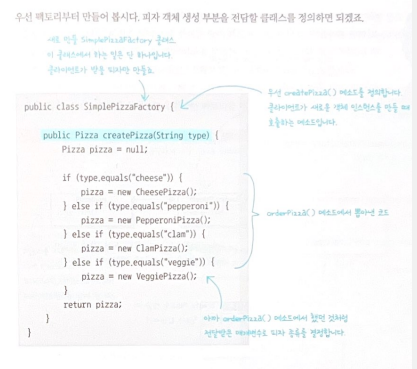

- 즉 우리는 많은 Pizza객체를 다양하게 생성해야 하는 PizzaStore Class에서 변경되는 부분을  다음과 같이 객체생성 부분을 전담할 클래스로 빼버림.

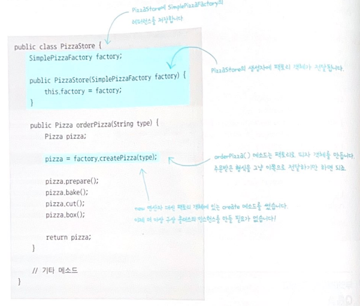

### "간단한 팩토리" 정의
- 간단한 팩토리는 디자인 패턴이라기 보다는 프로그래밍에서 자주 쓰이는 관용구에 가깝다.

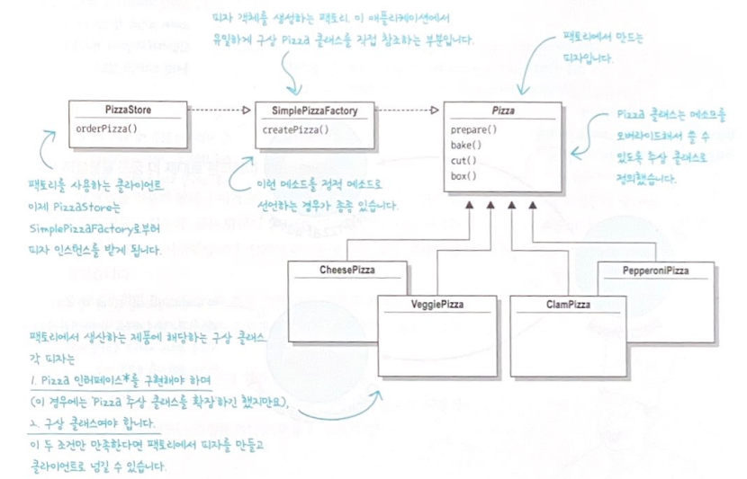

## 다양한 팩토리 만들기
- 피자가게가 잘되어서 이제 지점을 낼 때가 왔다! => 다양한 스타일의 피자 (뉴욕 스타일, 시카고 스타일, 캘리포니아 스타일 등)을 만들어 본다고 하자!

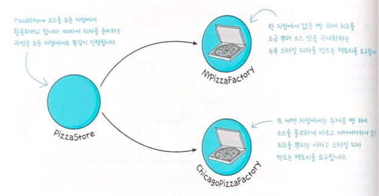
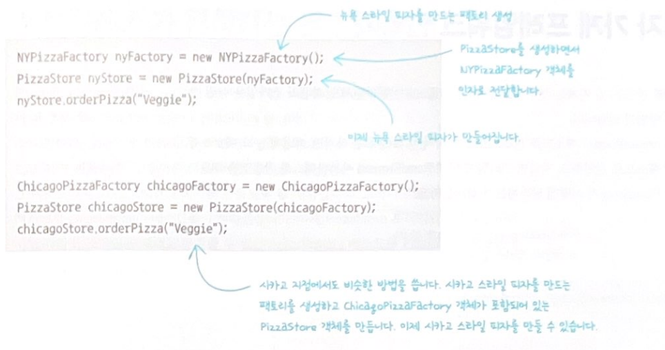

- 지역에 따라 만드는 피자가 달라지므로 지역별 스타일에 맞게 PizzaStore를 추상메소드로 하고 각 각각 서브클래스를 만들자!

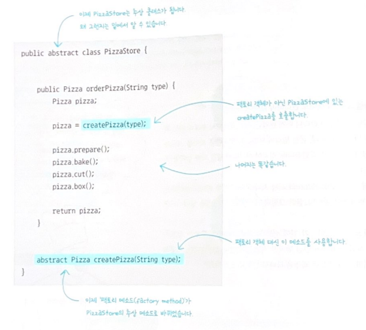

- 다음과 같이 피자를 각 지역에 따라 다르게 만들어야 하므로 서브클래스에서 오버라이딩하여 구현.

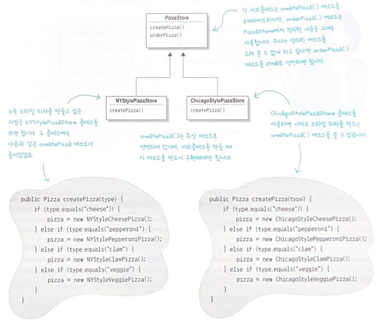

### Point! 즉 피자의 종류는 어떤 서브클래스를 선택했느냐에 따라 결정되는 것!

- 그래서 PizzaStore를 계속고친결과, 구상 클래스 인스턴스 만드는 일을 하나의 객체가 전부처리하는 방식에서 일련의 서브클래스가 처리하는 방식으로 바뀌었다! => 그러므로 다음과 같이 PizzaStore를 상속받은 서브클래스는 만들어야 하는 pizza를 return 하도록 createPizza를 오버라이딩 하여 구현하면 된다!

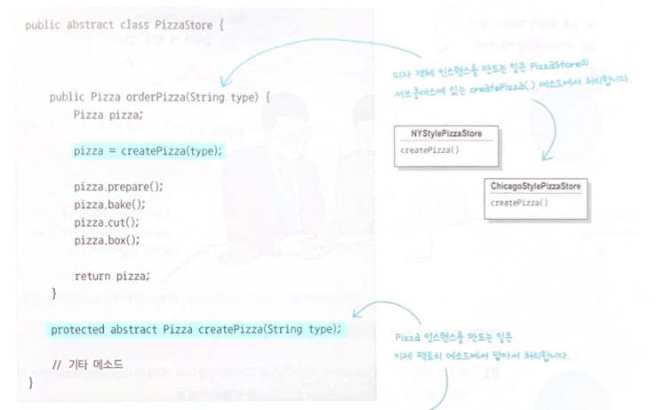3. 클래스 인스턴스 만드는 일을 서브클래스에게 맡긴다.


## 예를들어
- 우리가 피자가게를 운영해본다고 하자
=> 피자 종류가 하나만 있는 건 아니지? 그래서 피자종류를 파탕으로 인스턴스 생성하는 orderPizza 메소드를 정의


- 하지만 신메뉴를 추가하거나 메뉴를 없앤다면 우리는 다음과 같이 코드를 변경할 것 => 이는 OCP 법칙을 위배 


- 그리하여 OrderPizza() 메소드에서 가장 문제가 되는 부분은 <인스턴스를 만드는 구상클래스를 선택하는 부분> => 다음과 같이 피자 객체생성 부분을 전담할 클래스를 정의


- 즉 우리는 많은 Pizza객체를 다양하게 생성해야 하는 PizzaStore Class에서 변경되는 부분을  다음과 같이 객체생성 부분을 전담할 클래스로 빼버림.


### "간단한 팩토리" 정의
- 간단한 팩토리는 디자인 패턴이라기 보다는 프로그래밍에서 자주 쓰이는 관용구에 가깝다.


## 다양한 팩토리 만들기
- 피자가게가 잘되어서 이제 지점을 낼 때가 왔다! => 다양한 스타일의 피자 (뉴욕 스타일, 시카고 스타일, 캘리포니아 스타일 등)을 만들어 본다고 하자!


- 지역에 따라 만드는 피자가 달라지므로 지역별 스타일에 맞게 PizzaStore를 추상메소드로 하고 각 각각 서브클래스를 만들자!


- 다음과 같이 피자를 각 지역에 따라 다르게 만들어야 하므로 서브클래스에서 오버라이딩하여 구현.


### Point! 즉 피자의 종류는 어떤 서브클래스를 선택했느냐에 따라 결정되는 것!

- 그래서 PizzaStore를 계속고친결과, 구상 클래스 인스턴스 만드는 일을 하나의 객체가 전부처리하는 방식에서 일련의 서브클래스가 처리하는 방식으로 바뀌었다! => 그러므로 다음과 같이 PizzaStore를 상속받은 서브클래스는 만들어야 하는 pizza를 return 하도록 createPizza를 오버라이딩 하여 구현하면 된다!


- 그럼 실제 피자가 어떻게 만들어질까? 코드흐름으로 보자

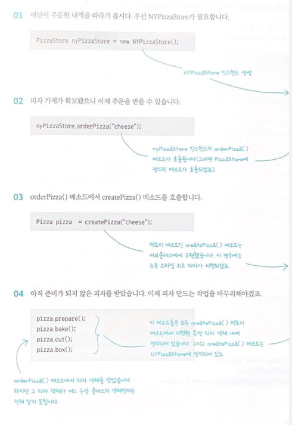

- 결국 Store(Factory) 들은 곧 피자(product)를 만드는 만들게 되는것인데.. 피자는 어떻게 정의할 것이냐! => 수많은 피자종류가 있기 때문에 공통된 부분은 놔두고 달라지는 속성부분만 변경할 수 있도록 추상 메소드로 정의하자!

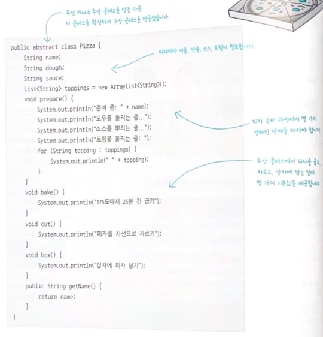
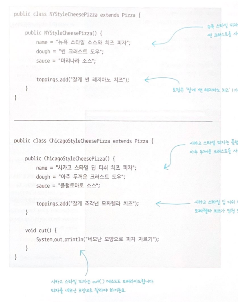

- 그럼 우리는 다음과 같이 사용하면 된다! 

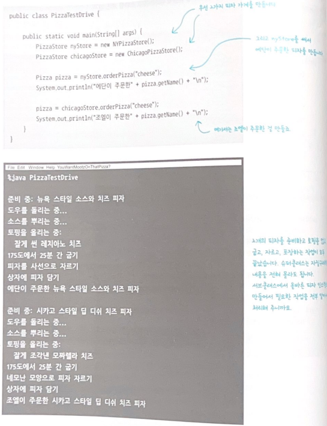

### 여기서 잠깐! 지금까지의 구조를 살펴보면 => 병렬 클래스 계층구조

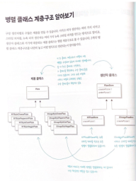


### 팩토리 메소드 패턴의 정의
1. 객체를 생성할 때 필요한 인터페이스를 만든다.
2. 어떤 클래스의 인스턴스를 만들지는 서브클래스에서 결정한다.
3. 클래스 인스턴스 만드는 일을 서브클래스에게 맡긴다.

```
즉 사용하는 서브클래스에 따라 생성되는 객체 인스턴스가 결정된다!
```

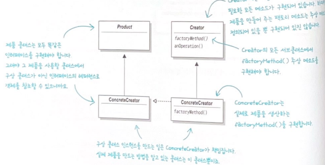


### "심하게 의존적인 Pizza 클래스가 있다?!"

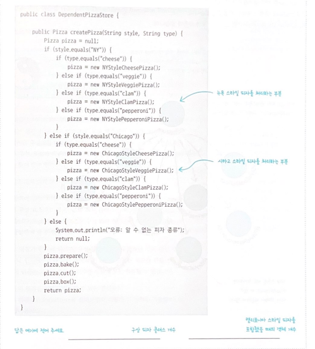

- 왜? 해당 코드에서는 모든 피자 객체를 팩토리에 맡겨서 만들지 않고, PizzaStore 클래스 내에서 직접만들었다! 코드 다이어 그램을 보면 다음과 같다.

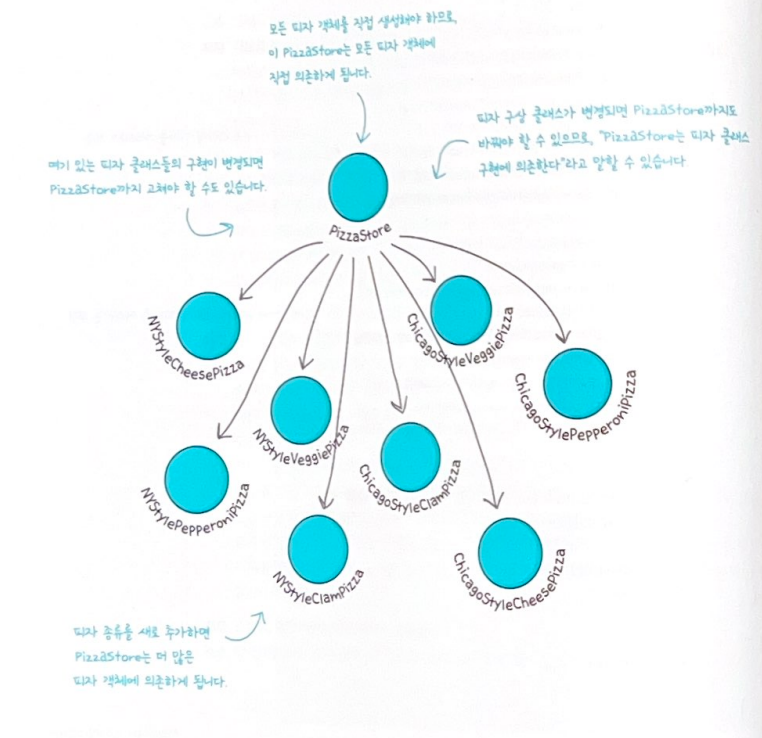


### 의존성 뒤집기 원칙
- 구성 클래스의 의존성을 줄이면 좋다는 사실은 알았다! 해당 내용을 정리한 객체지향 디자인 원칙인 "의존성 뒤집기 원칙'
```
추상화된 것에 의존하게 만들고 구상클래스에 의존하지 않게 만든다.
```

- 이제 무슨소리야? 고수준 구성요소가 저수준 구성요소에 의존하면 안되며, 항상 추상화에 의존하게 만들어야 한다는 뜻
- 이제 무슨말이야? PizzaStore는 "고수준 구성요소"라고 할 수 있고, 피자 클래스는 "저수준 구성요소"라고 할 수 있다. PizzaStore클래스는 구상피자 클래스에 의존하고 있다는 사실을 앞에서 확인할 수 있었지!
- 즉 고수준 구성요소는 다른 저수준 구성요소에 의해 정의되는 행동이 들어있는 구성요소를 뜻한다.

### 우리는 그래서 의존성 뒤집기 원칙을 적용하자
- 추상클래스를 적용해서 고수준 요소와 저수준 요소와의 의존성을 느슨하게 하자!
- 이전 다이어그램에서 의존성이 위에서 아래로 내려가기만 했던 것과는 반대로 뒤집어져 있음.
- 고수준 모듈과 저수준 모듈이 둘 다 하나의 추상클래스에 의존하게 되는 구조를 만들자!

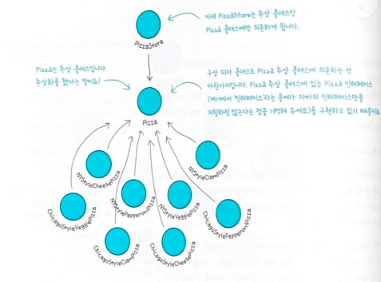

### 의존성 뒤집기 원칙을 지키는 방법?
- 변수에 구상 클래스의 레퍼런스를 저장하지 말자!
- 구상 클래스에서 유도된 클래스를 만들지 말자!
- 베이스 클래스에 이미 구현되어 있는 메소드를 오버라이딩 하지 말자!

## 원재료군으로 묶기
- 이번에는 더더 피자가게가 커져서 뉴욕과 시카고에서 사용하는 재료는 서로 달라졌다! 즉 각 Factory마다 피자를 생성할 때 사용하는 원재로가 다르다면 어떻게 처리할 수 있을까? => 예를들어 뉴욕은 Fresh한 재료쓰고, 시카고는 냉동재료쓰고..

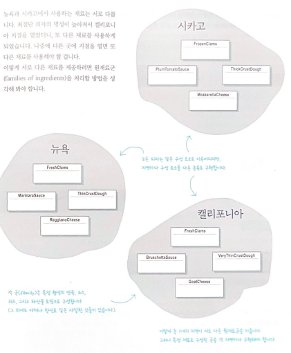


- 그렇다면 원재료를 생산하는 팩토리를 만들어야 겠지? 해당 팩토리에서는 원재료 군에 들어있는 각각의 원재료를 생산한다! 즉 반죽, 소스, 치즈 같은 걸 만들어야 한다!

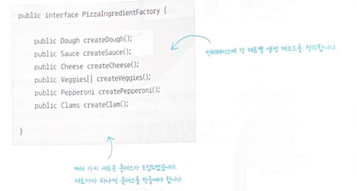

- 뉴욕 원재료의 패턴을 한번 만들어볼까? 

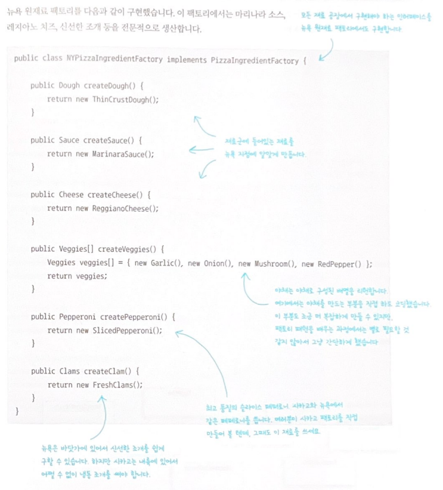

- Factory를 모두 만들었으니 이제 재료를 생산할 준비가 끝! => Pizza 클래스가 팩토리에서 생산한 원재료만 사용하도록 코드를 고쳐보자! 우선 Pizza 추상클래스부터 다음과 같이 바꿔보자

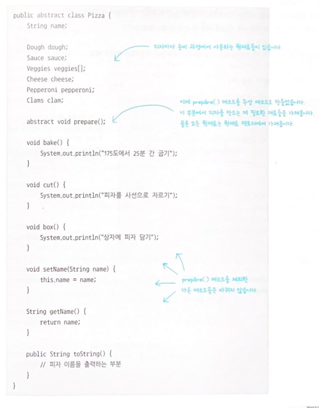


#### "팩토리 메소드 패턴에서는 어떤 클래스의 인스턴스를 만들지를 서브클래스에서 결정한다?"
- "결정한다"라는 표현을 쓰는 이유는 실행중에 서브클래스에서 어떤 클래스의 인스턴스를 만들지 결정해서가 아니라, 생산자 클래스가 실제 생산될 제품을 전혀 모르는 상태로 만들어지기 때문
- 사실 더 정확히 말하면 "사용하는 서브클래스에 따라 생산되는 객체 인스턴스가 결정된다."


