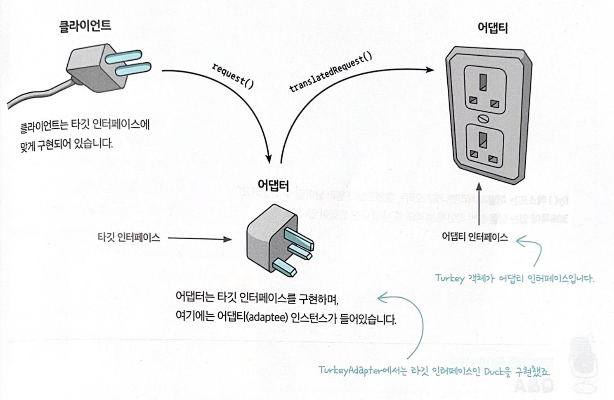
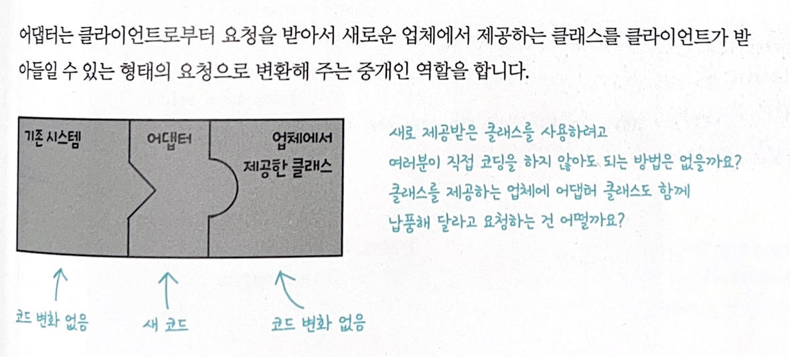
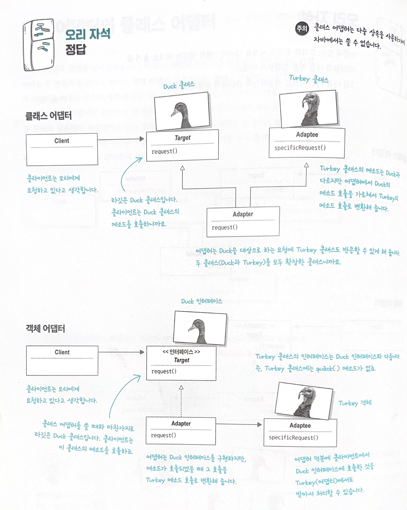
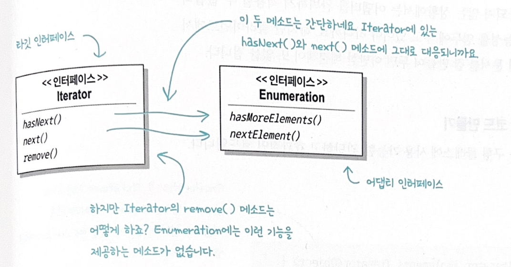
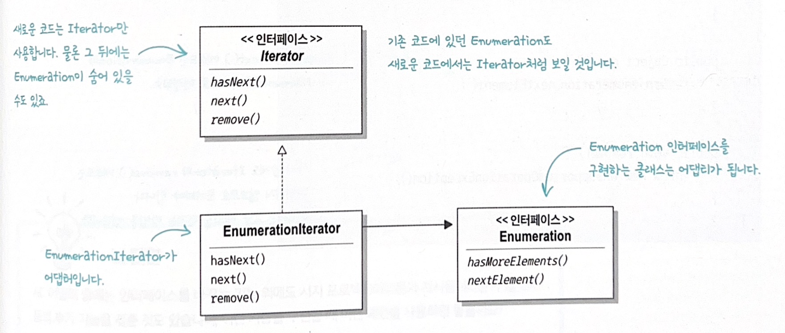
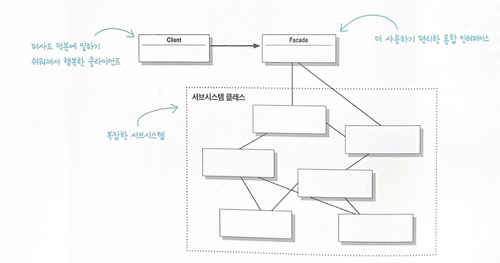
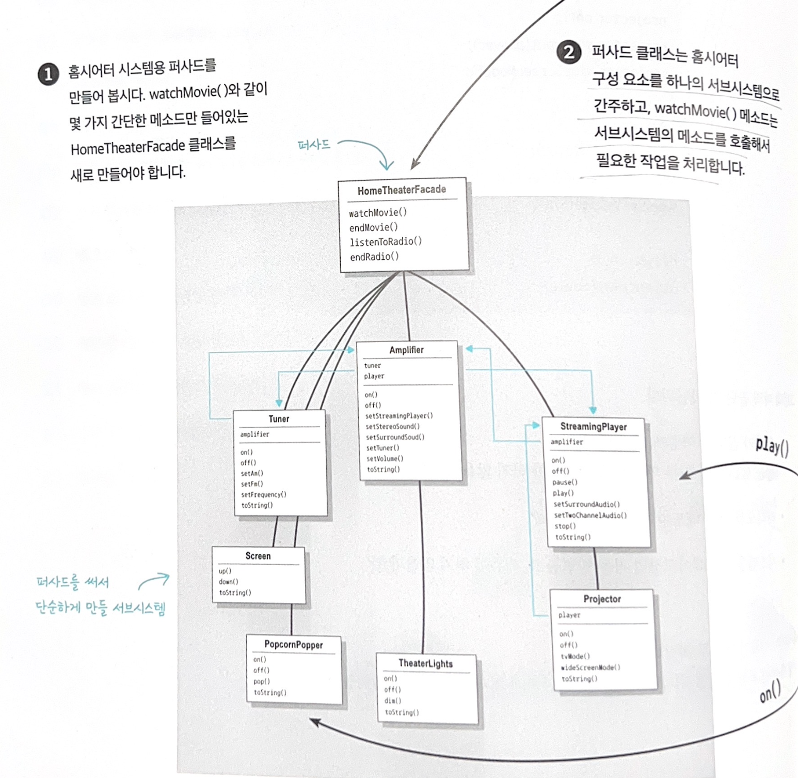

# 챕터 4. 어댑터 & 퍼사드 패턴

## 어댑터 패턴
특정 클래스 인터페이스를 클라이언트에서 요구하는 다른 인터페이스로 변한한다. 인터페이스가 호환되지 않아 같이 쓸 수 없던 클래스를 사용할 수 있게 도와준다.
```
흔히 한국에서 사용하던 돼지코 220V 짜리 충전기를 일본에 가져가서 사용할 때 110V 구멍에 맞지 않으므로 우리는 어댑터가 필요하다.
```


- 다음과 같이 객체지향 세계에서의 어댑터는 기존 시스템를 변경할 수 없고, 새로운 업체에서 제공받은 클래스도 변경할 수 없는 경우에 어댑터 패턴을 사용할 수 있다.



## 예를들어
- 1장예시였던 오리(Duck) 객체가 모자라서 Turkey 객체를 대신 사용해야 하는 상황이라고 가정해보자.
```java
public interface Duck{
    public void quack();
    public void fly();
}
```

```java
public calss MallardDuck implements Duck{
    pulic void quack(){
        System.out.println("꽥");
    }

    public void fly(){
        System.out.println("날고있어요!");
    }
}
```

```java
public interface Turkey{
        public void gobble(); // 칠면조는 꽥꽥거리지 않는다. 골골 소리낸다
        public void fly(); // 칠면조도 날수 있긴하지만 멀리 날지 못한다.
    }
```

```java
public class WildTurkey implements Turkey {
    public void gobble(){
        System.out.println("골골");
    }

    public void fly(){
        System.out.println("짧은 거리를 날고 있어요!");
    }
}
```

- 클라이언트가 Duck 일 경우 Turkey를 사용하기 위한 Adapter Class
- 다음과 같이 적응시킬 형식의 인터페이스를 구현해야 한다. 다시말해, 클라이언트에서 원하는 인터페이스를 구현해야 한다.
- 새로운 시스템은 터키, 기존시스템은 Duck으로 결국 클라이언트는 Duck의 인터페이스에 정의된 메서드를 호출할 것임.
```java
public Class TurkeyAdapter implements Duck{
    Turkey turkey;

    public TurkeyAdapter(Turkey turkey){ // 기존 형식 객체의 레퍼런스가 필요. 생성자에서 레퍼런스를 받아오는 작업을 처리
        this.turkey = turkey;
    }

    // 이때 인터페이스에 들어있는 메소드를 모두 구현해야 함.
    // 하지만 내부의 구현은 Turkey에게 행동을 전가하고 있음
    public void quack(){
        turkey.gobble();
    }

    public void fly(){
        for(int i=0; i<5; i++){
            turkey.fly();
        }
    }
}
```

- 오리 어댑터 테스트용 코드
```java
public class DuckTestDrive{
    public static void main(String[] args){
        Duck duck = new MallardDuck();

        Turkey turkey = new WildTurkey();
        Duck turkeyAdapter = new TurkeyAdapter(turkey); // Turkey 객체를 TurkeyAdapter로 감싸서 Duck 객체처럼 보이도록 만든다.

        System.out.println("칠면조가 말하길");
        turkey.gobble();
        turkey.fly();

        System.out.println("\n오리가 말하길");
        testDuck(duck);

        System.out.println("\n칠면조 어댑터가 말하길");
        testDuck(turkeyAdapter);
    }

    static void testDuck(Duck duck){
        duck.quack();
        duck.fly();
    }
}
```
```shell
칠면조가 말하길
골골
짧은 거리를 날고 있어요!

오리가 말하길
꽥
날고 있어요!

칠면조 어댑터가 말하길
골골
짧은 거리를 날고 있어요!
짧은 거리를 날고 있어요!
짧은 거리를 날고 있어요!
짧은 거리를 날고 있어요!
짧은 거리를 날고 있어요!
```

## 어댑터 패턴 구성요소
|클라이언트|어댑터|어댑티|
|------|---|---|
|Duck|타깃 인터페이스인 Duck을 구현|Turkey 객체|

- 클라이언트에서 어댑터 사용방법
1. 클라이언트에서 타깃 인터페이스로 메소드를 호출해서 어댑터에 요청을 보낸다.
2. 어댑터는 어댑티 인터페이스로 그 요청을 어댑티에 관한(하나 이상의) 매소드 호출로 변환한다.
3. 클라이언트는 호출결과를 받긴 하지만 중간에 어댑터가 있다는 사실을 모른다.
<br> => 여기서 중요한건 **클라이언트**와 **어댑티**는 **서로 분리**되어있다! 서로를 모른다!


## 객체 어댑터와 클래스 어댑터
- 어댑터에는 두 종류가 존재한다. (객체 어댑터와 클래스 어댑터)

|객체 어댑터|클래스 어댑터|
|------|---|
|어댑터에 요청을 위임|타겟과 어댑터 모두 서브클래스로 만들어서 사용|
|타켓추상 클래스를 구현(Implements)|2개 이상의 서브 클래스를 상속(Extends)|
||2개 이상의 클래스를 상속해야 하므로 다중상속이 가능한 언어에서 사용가능. i.g, python |
|타겟(Duck)이 인터페이스일 경우|타겟(Duck)이 구상? 추상? 클래스일 경우|



## 자바에서 어댑터 패턴 실전적용!
### **Enumeration** 를 **Iterator** 의 Adapater로 씌워 Enumeration을 Iterator에 적응시키기  



- EnumerationIterator 어댑터 코드
```java
public class EnumerationIterator implements Iterator<Object>{
    Enumeration<?> enumeration;

    public EnumerationIterator(Enumeration<?> enumeration){
        this.enumeration = enumeration;
    }

    public boolean hasNext(){
        return enumeration.hasMoreElements();
    }

    public Object next(){
        return enumeration.nextElement();
    }

    public void remove(){ // Iterator의 remove() 메소드는 지원되지 않으므로 포기. 그냥 예외를 던지는 방법 사용
        throw new UnsupportedOperationException();
    }
}
```

|데코레이터 패턴|어댑터 패턴|
|------|---|
|객체의 행동과 책임을 확장하는 일|감싸고 있는 인터페이스를 변환|
|기존 코드를 고치지 않아도 클래스에 새로운 행동을 추가할 수 있음|기존 코드를 하나도 고치지 않고 새로운 라이브러리를 사용할 수 있음|


## 퍼사드 패턴
- 서브시스템에 있는 일련의 인터페이스를 통합 인터페이스로 묶어준다. 또한 고수준 인터페이스도 정의하므로 서브시스템을 더 편리하게 사용할 수 있다.
```
우리는 집에서 홈시어터로 영화볼 때 Screen으로 영화만 트는 것 이 아니라 앰프, 조명, 팝콘 기계 등 쇼파에 영화를 앉아서 보기위해 상당히 많은 절차를 거친다. 이렇게 각 서브클래스들이 필요한 작업을 실행되도록 묶는 것을 퍼사드라고 한다! 
```


## QA
1. 퍼사드는 서브시스템 클래스를 캡슐화 하는가? No. 서브시스템의 기능을 사용할 수 있는 간단한 인터페이스를 제공할 뿐
2. 퍼사드는 새로운 행동을 구현하는가? No. 각 구성요소를 켜고, 적절한 모드로 설정하는 method 로만 구성됨.
3. 퍼사트의 장점은? 확장가능성! 새로운 서브시스템이 들어오면 단지 해당 클래스만 추가하여 퍼사드만 약간 바꾸어서 사용가능하다.


## 홈시어터 퍼사드 만들기


- 영화보고 싶으면 amp 키고, 팝콘기계 돌리고 각각 할 필요없이 다음과 같이 HomeTheaterFacade 객체의 watchMovie() 만 호출하면 필요한 작업 전부 알아서 해줌.

```java
public class HomeTheaterFacade{ // 구성부분으로 사용하고자 하는 서브시스템의 모든 구성요소가 인스턴스 변수형태로 저장.
    Amplifier amp;
    Tuner tuner;
    StreamingPlayer player;
    Projector projector; 
    // 생략 //

    public HomeTheaterFacade(Amplifier amp, // 퍼사드의 생성자에는 서브시스템 구성요소의 레퍼런스가 전달, 퍼사드는 각 레퍼런스를 인스턴스 변수에 저장
            Tuner tuner,
            StreamigPlayer player
            Projector projector, ...){
                this.amp = amp;
                this.tunner = tunner;
                // 생략 //
            }

    public void watchMoive(String movie){ // 일일이 수동으로 했던 서스클래스의 작업을 순서로 처리, 복잡한 일을 하나의 메소드로 간단하게 처리. 각 작업은 서브시스템에 들어있는 구성요소에게 위임
        popper.on();
        popper.pop();
        lights.dum(10);
        screen.down();
        projector.on();
        projector.wideScreenMode();
        amp.on();
        amp.setStreamingPlayer(player); 
        // 생략 //
    }
}
```

## 어댑터와 퍼사드 패턴의 키 포인트
```
1. 퍼사드는 인터페이스를 단순하게 만들고 클라이언트와 구성요소로 이루어진 서브시스템을 분리하는 역할도 한다.
2. 퍼사드와 어댑터는 모두 여러개의 클래스를 감쌀 수 있다. 하지만 퍼사드는 인터페이스를 단순하게 만드는 용도로 쓰이는 반면, 어댑터는 인터페이스를 다른 인터페이스로 변환하는 용도로 쓰인다.
```