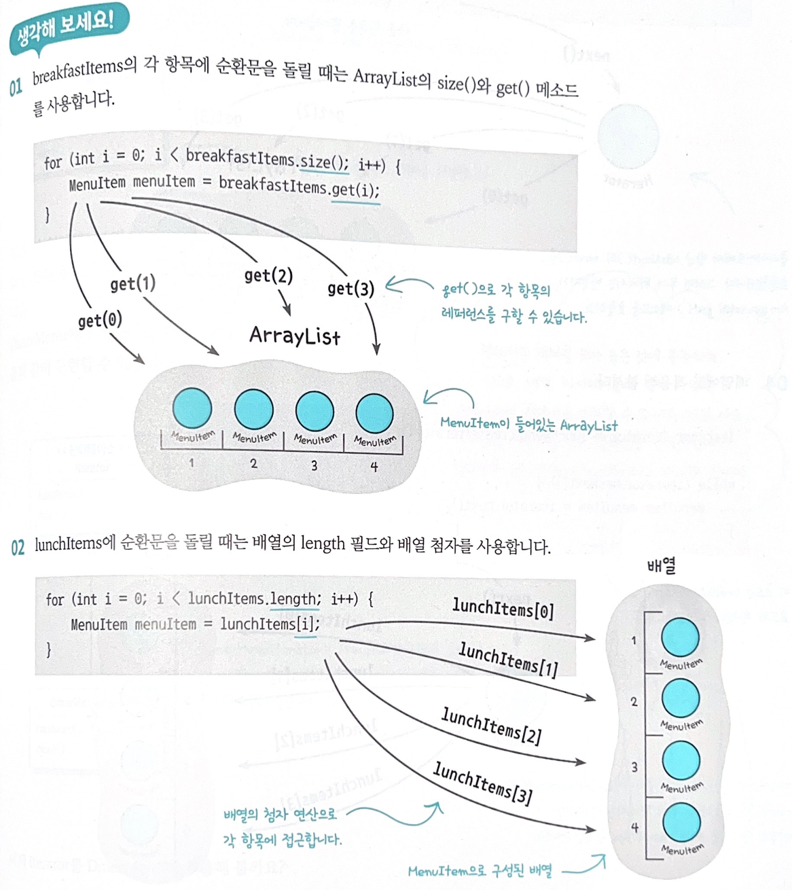
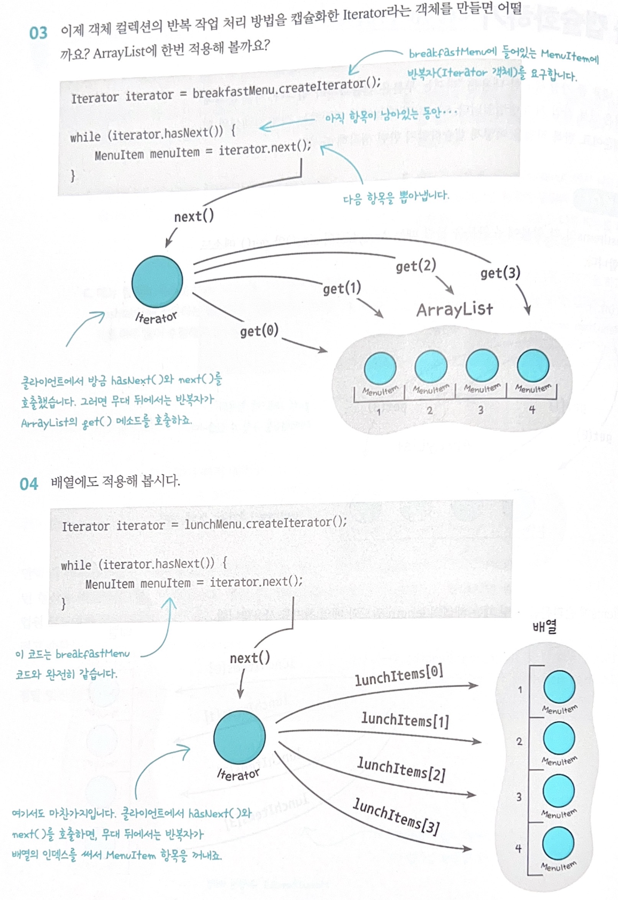
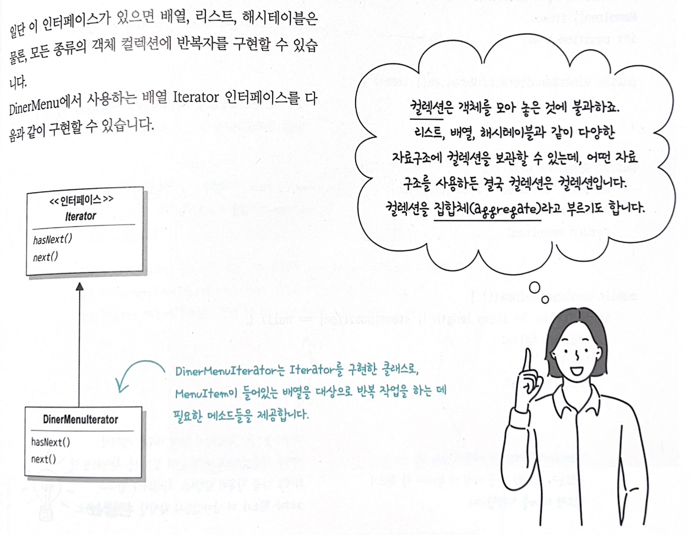
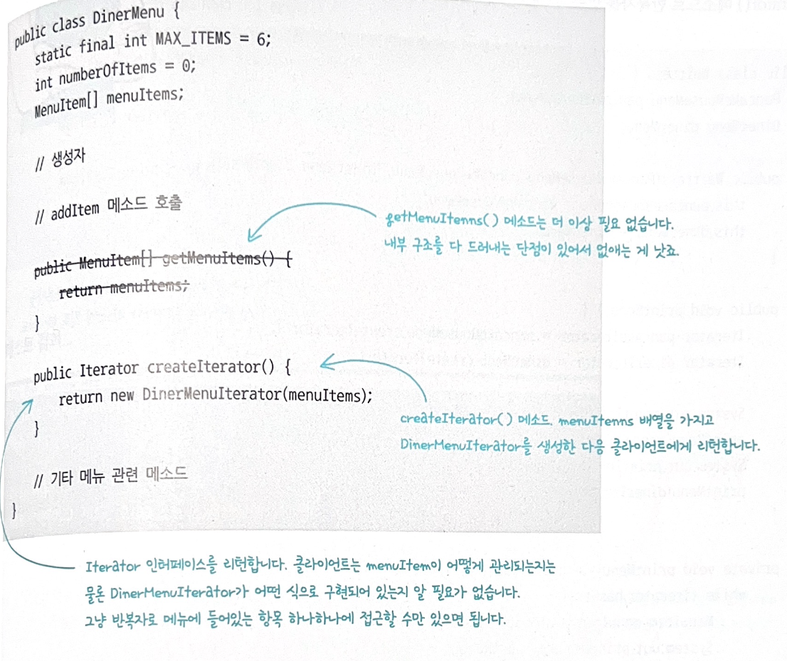
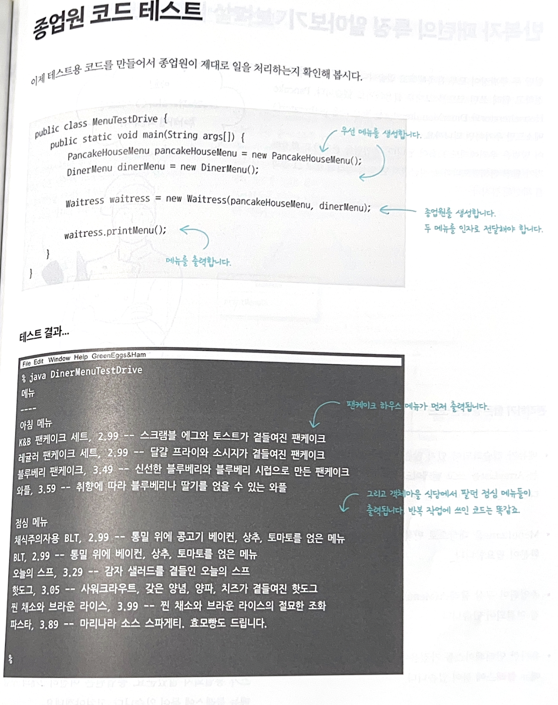
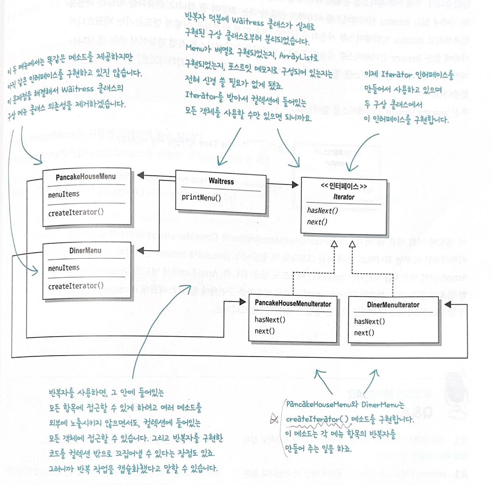
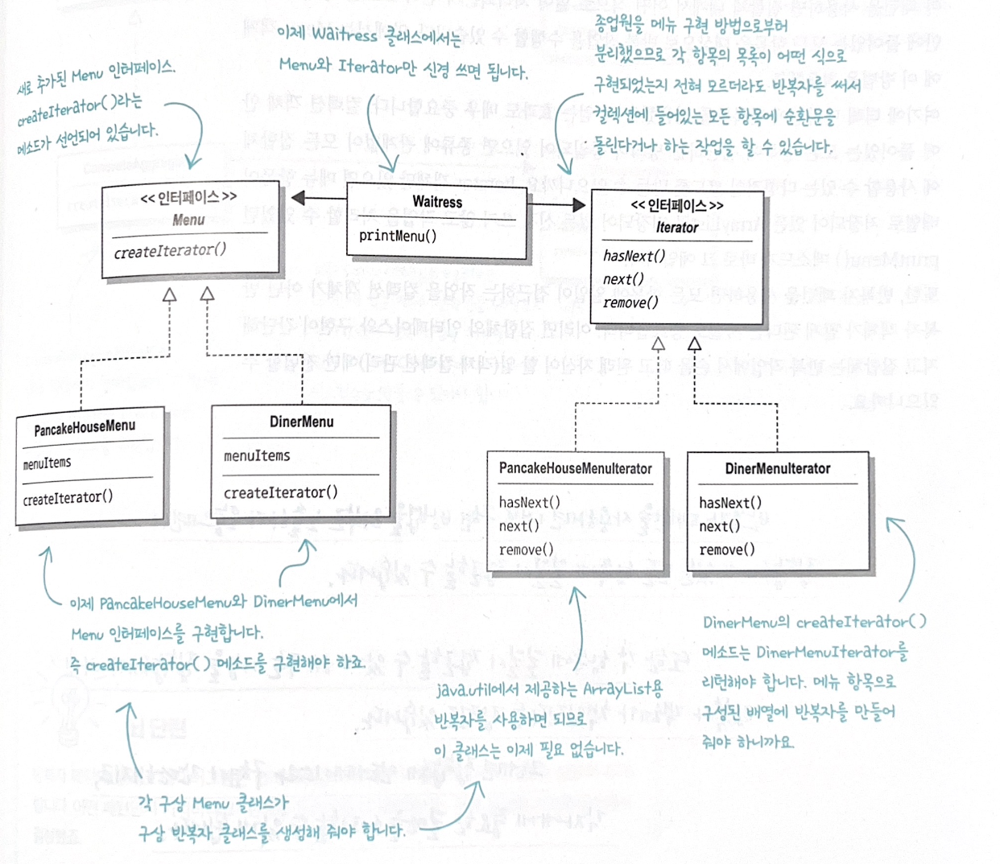
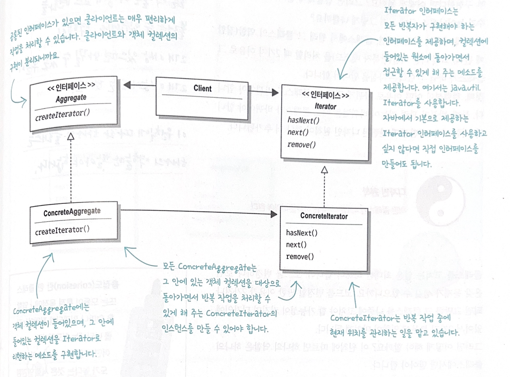

# 챕터 5. 반복자 & 컴포지트 패턴

## 반복자 패턴
```
반복자 패턴은 컬렉션의 구현방법을 노출하지 않으면서 집합체 내의 모든 항목에 접근하는 방법을 제공한다.
```

- 집합체 내에서 어떤 식으로 일이 처리되는지 전혀 모르는 상태에서 그 안에 들어있는 모든 항목을 대상으로 반복작업 수행가능
- 디자인에 반복자를 적용했을 때 걸렉션 객체 안에 들어있는 모든 항목에 접근하는 방식이 통일되어 있으면 종류에 관계없이 모든 집합체에 사용할 수 있는 다형적인 코드를 만들 있음. e.g, Iterator 객체만 있으면 메뉴항목이 배열로 저장되어 있든 ArrayList로 저장되어 있든 신경쓰지 않고 작업을 처리할 수 있는 printMenu() 메소드.
- 반복자 패턴을 사용하면 모든 항목에 일일이 접근하는 작업을 컬렉션 객체가 아닌 반복자 객체가 맡게 됨 -> 집합체의 인터페이스와 구현이 간단해지고 집합체는 반복작업에서 손을 떼고 원래 자신이 할 일 (객체 컬렉션 관리)에만 전념할 수 있음

---
## 속보! 객체마을 식당과 펜케이크 하우스 합병
- 펜케이크 하우스에서 파는 아침메뉴와 객체마을 식당에서 파는 점심메뉴를 한곳에서 먹을 수 있게 됨.
- 이에 메뉴 항목을 나타내는 MenuItem 클래스의 구현방법은 합의
- 하지만 메뉴항목을 저장하는 MenuItems 객체의 경우 서로 다른 형태로 구현됨.


### 자바 종업원의 자격요건
1. printMenu(): 메뉴에 있는 모든항목을 출력
2. printBreakfastMenu(): 아침식사 항목만 출력
3. printLunchMenu(): 점심식사 항목만 출력
4. printVegetarianhMenu(): 채식주의자용 메뉴항목한 출력
5. isItemVegetarian(name): 해당 항목이 채식주의자 용이면 true를 리턴하고 그렇지 않으면 false 를 리턴

### 자격 요건 구현하기
- printMenu() 메소드 구현
```java
// 서로 return 형식이 다름
PancakeHouseMenu pancakeHouseMenu = new PancakeHouseMenu();
ArrayList<Menuitem> breakfastItems = pancakeHouseMenu.getMenuItems();

DinerMenu dinerMenu = new DinerMenu();
MenuItem[] lunchItems = dinerMenu.getMenuItems();
```

- 각 객체형식에 맞게 순환문 사용
```java
for (int = i=0; i < breakfastItems.size(); i++){
    MenuItem menuItem = breakfastItems.get(i);
    // print menu
}

for (int i = 0; i < lunchItems.length; i++){
    MenuItem menuItem = lunchItems[i];
    // print menu
}
```

- 다음과 같이 "반복을 캡슐화" 하여 인터페이스로 통합하자! 



- 반복자 패턴은 Iterator 인터페이스에 의존한다라는 사실!


- 객체마을 식당메뉴에서 반복자 사용하기. 어떻게? createIterator() 메소드를 통해 Iterator를 생성하여 클라이언트에게 리턴하는 코드만 추가


### 인터페이스 개선하기
#### java.util.Iterator 적용하기
- pancakeHouseMenu 에서 java.util.Iterator를 사용하도록 하는 것이 더 편리
- PancakeHouseMenuIterator 클래스를 지워버리고 PancakeHouseMenu코드 맨 위에 import java.util.Iterator를 추가한다음 1줄의 코드만 고치면 됨.
```java
public Iterator<MenuItem> createIterator(){
    return menuItems.iterator();
}
```
```java
import java.util.Iterator; // import 구문 추가

public class DinerMenuIterator implements Iterator<MenuItem>{
    MenuItem[] items;
    int position = 0;

    public DinerMenuIterator(MenuItem[] items){
        this.items = items;
    }

    public MenuItem next(){
        //기타코드
    }

    public boolean hasNext(){
        //기타코드
    }

    public void remove(){
        throw new UnsupportedOperationException("메뉴항목은 지우면 안됩니다.); //iterator 인터페이스에서 remove()메소드는 필수가 아님. 그냥 예외를 던지는 식으로 처리
    }
}
```

#### 종업원 코드에 반복자 적용하기
- 반복자를 인자로 받는 printMenu() 메소드를 만들고 각 메뉴의 getIterator() 메소드로 반복자를 받은 후 새로운 메소드에 넘기기.
```java
public class Waitress{
    PancakeHouseMenu pancakeHouseMenu;
    DinerMenu dinerMenu;

    public Waitress(PancakeHouseMenu pancakeHouseMenu, DinerMenu dinerMenu) { // 생성자에서 두 메뉴를 인자로 받아오기
        this.pancakeHouseMenu = pancakeHouseMenu;
        this.dinerMenu = dinerMenu;
    }

    public void printMenu(){
        // 메뉴마다 하나씩 필요하므로 2개의 반복자를 생성. 
        Iterator pancakeIterator = pancakeHouseMenu.createIterator();
        Iterator dinerIterator = dinerMenu.createIterator();
        //print 아침식사, 점심식사
        printMenu(pancakeIterator);
        printMenu(dinerIterator);
    }

    private void printMenu(Iterator iterator){
        while(iterator.hasNext()){
            MenuItem menuItem = iterator.next();
            // print Name, Price, Description
        }
    }

    // 기타메소드
}
```
#### 종업원 코드결과



### 통합식당코드 다시살펴보기



### 인터페이스 개선하기
- PancakeHouseMenu와 DinerMenu의 인터페이스가 완전히 똑같음에도 아직 인터페이스를 통일하진 않음
- 인터페이스를 통일한 다음 종업원 코드를 조금 더 깔끔하게 고쳐보자!
- 자바에 있는 Iterator 인터페이스를 사용하자.
```java
public inferface Menu {
    public Iterator<MenuItem> Iterator();
}
```

```java
import java.util.Iterator; // waiterss 도 java iterator 사용

public class Waitress{
    Menu pancakeHouseMenu;
    Menu dinerMenu;

    public Waitress(Menu pancakeHouseMenu, Menu dinerMenu) { // 구상메뉴 클래스를 Menu인터페이스로 바꾸자
        this.pancakeHouseMenu = pancakeHouseMenu;
        this.dinerMenu = dinerMenu;
    }

    public void printMenu(){
        Iterator<MenuItem> pancakeIterator = pancakeHouseMenu.createIterator();
        Iterator<MenuItem> dinerIterator = dinerMenu.createIterator();
        //print 아침식사, 점심식사
        printMenu(pancakeIterator);
        printMenu(dinerIterator);
    }

    public void printMenu(Iterator iterator){
        while(iterator.hasNext()){
            MenuItem menuItem = iterator.next();
            // print Name, Price, Description
        }
    }

    // 기타메소드
}
```

### 변경된 통합식당 코드 살펴보기


### 반복자 패턴과 구조
```
반복자 패턴은 컬렉션의 구현방법을 노출하지 않으면서 집합체 내의 모든 항목에 접근하는 방법을 제공한다.
```




