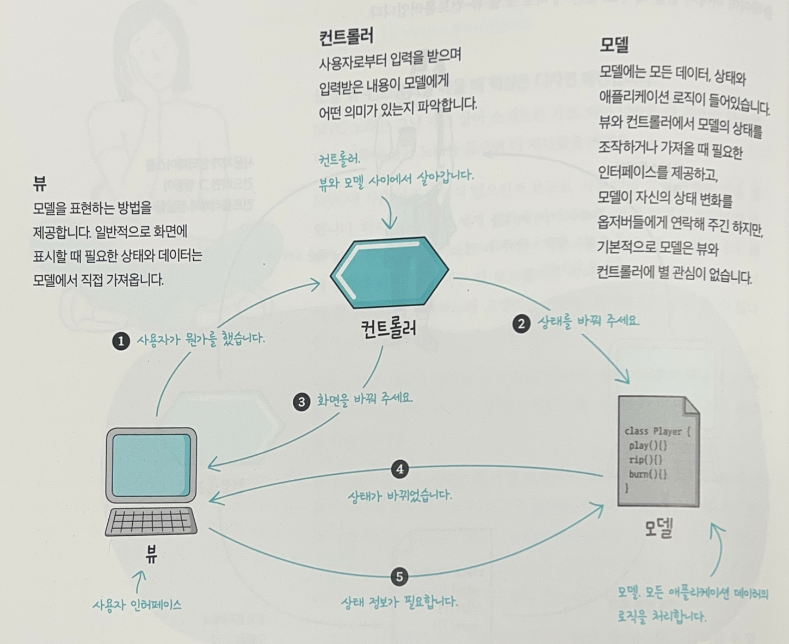
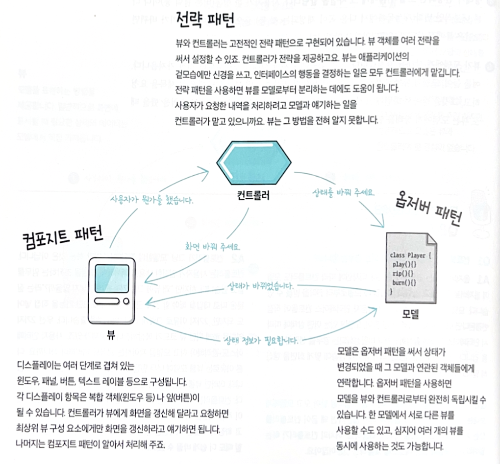
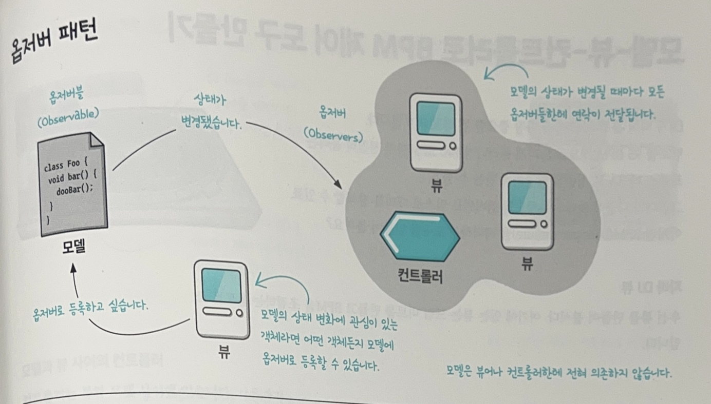
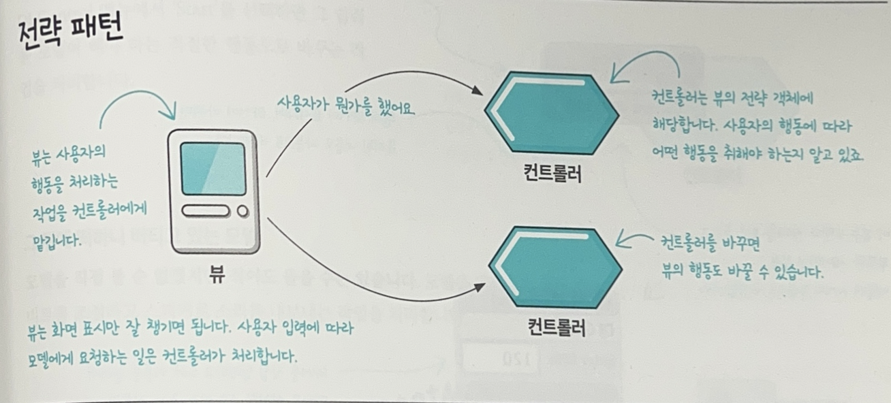
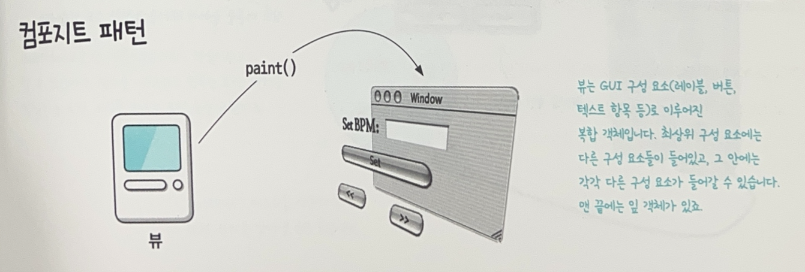
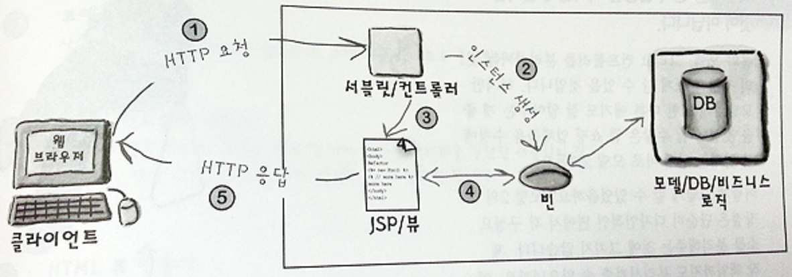
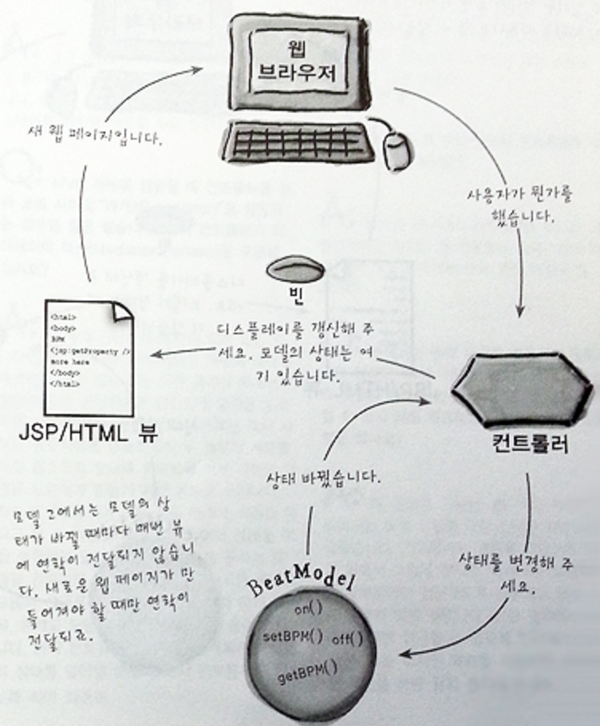

# Compound Pattern
```
일반적으로 자주 생길 수 있는 문제를 해결하기 위한 용도로 2개 이상의 패턴을 결합해서 사용하는 것을 뜻한다.
```

- 패턴 몇 개를 결합해서 쓴다고 해서 무조건 컴파운드 패턴이 되는 것은 아니다.
- 위의 정의에도 이미 언급했듯이 무엇을 위한 용도인지 확실히 이해하자.
- 진정한 컴파운드 패턴이라 할 수 있는 'MVC' 에 대해 알아보자.
- 추가적으로 이 MVC 를 웹 환경에 맞게 변형시킨 '모델 2 (Model 2)' 까지 살펴보자.

### MVC
- Model - View - Controller 의 약자


- Model : 모든 데이터, 상태 및 어플리케이션 로직이 들어있다. View 와 Controller 에서 Model 의 상태를 조작하거나 가져오기 위한 인터페이스를 제공한다. 또한 Model 에서 자신의 상태 변화에 대해서 Observer 들한테 연락을 해주긴 하지만, 기본적으로 Model 은 View 및 Controller 에게 별 관심이 없다.

- View : Model 을 표현하는 방법을 제공한다. 일반적으로 화면에 표시하기 위해 필요한 상태 및 데이터는 Model 에서 직접 가져온다.

- Controller : 사용자로부터 입력을 받아서 그것이 Model 에게 어떤 의미가 있는지 파악한다.

### 이 MVC 에는 어떤 패턴들이 결합되어 있는 형태인지 알아보자.



#### 옵저버패턴

Model 이 Observable 에 해당하고, Model 의 상태가 바뀔 때마다 Model 로부터 정보를 전달받고 싶은 녀석들이 Observer 에 해당한다. 이를 이용하면 Model 을 View 와 Controller 로부터 완전히 독립시킬 수 있다.

#### 전략패턴

Controller 는 View 의 행동(Behavior)에 해당하며, View 가 다른 행동을 원한다면 간단하게 다른 Controller 로 교환하기만 하면 된다. 즉, Controller 가 전략을 제공하고 View 에서는 어플리케이션의 겉모습에만 신경쓰고 인터페이스의 행동에 대한 결정은 모두 Controller 에게 맡긴다. 이는 View 를 Model 로부터 분리시키는 데에 도움이 된다.

#### 컴포지트 패턴

View 안에서는 내부적으로 Composite 패턴을 써서 윈도우, 패널, 버튼 같은 다양한 구성요소를 관리한다. 각 디스플레이 항목은 복합 객체(윈도우 등) 또는 잎(버튼)이 될 수 있다. Controller 가 View 에게 화면을 갱신해달라고 요청할 때, 최상위 View 구성요소한테만 화면을 갱신하라고 요청하면 된다. 나머지는 Composite 패턴에 의해 자동으로 처리된다.

---
### 추가내용
#### MVC 를 브라우저/서버 모델에 맞게 변형시켜서 사용하고는 하는데, 가장 많이 쓰이는 방법이 '모델 2 (Model 2)' 이다.


① HTTP 요청 보통 사용자 ID, 비밀번호와 같은 Form 데이터가 함께 서블릿으로 전달된다. 서블릿에서는 이러한 데이터를 받아 Parsing 한다.


② Servlet 이 Controller 역할을 한다. 사용자 요청을 처리하고 대부분의 경우에 모델(보통 DB)에 어떤 요청을 하게 된다. 요청을 처리한 결과는 일반적으로 자바빈(JavaBean) 형태로 포장된다.


③ Controller 는 컨트롤을 View 에게 넘긴다. View 는 JSP 에 의해 표현된다. JSP 에서는 (④ 자바빈을 통해 얻은) 모델의 View 를 나타내는 페이지만 만들어주면 된다. 물론 다음 단계를 위해 몇 가지 제어해야 할 일이 있을 수도 있다.

⑤ View 에서 HTTP 를 통해 웹 브라우저에게 페이지를 전달한다.

### Model 2 는 단지 깔끔한 디자인에 불과한 것이 아니다

디자인적인 면에서 Model, View, Controller 를 분리시켜줄 뿐만이 아니라 제작 책임까지도 분리시켜줄 수 있다. Model 2 가 등장하면서 개발자들은 Servlet 에만 전념하면 되고, 웹 제작자들은 간단한 Model 2 스타일의 JSP 만 다루면 되는 환경이 조성되었다. 그래서 웹 제작자들은 HTML 과 간단한 JavaBeans 만 건드리면 된다.

### Design Patterns 과 Model 2

- 모델 2 는 MVC 를 웹에 맞게 적응시킨 것이다. 비록 모델 2 가 MVC 와 똑같이 생긴 것은 아니나 여전히 MVC 의 핵심 요소들을 포함하고 있다.

① Observer 패턴: View 는 더 이상 Model 의 Observer 라 할 수 없다. Model 한테 등록해서 Model 의 상태가 바뀌었다는 연락을 받는다거나 하지 않기 때문이다. 하지만 Controller 가 빈(Bean)을 건네주는 덕분에 Model 의 상태가 바뀐 것을 간접적으로 연락을 받는다. View 에서는 브라우저로 HTTP 응답을 할 때만 Model 의 상태 정보가 필요하기 때문에 HTTP 응답을 하지 않는 상태에서 Model 로부터 연락을 받아봤자 할 일이 없다.

② Strategy 패턴 고전적인 MVC 처럼 View 객체에 Controller 객체에 대한 레퍼런스가 들어가는 방식으로 구현되지 않는다. 하지만 여전히 (Servlet 으로 만든) Controller 가 View 의 행동을 구현하는 전략 객체로 쓰이고, 다른 행동을 원할 때 다른 Controller 로 바꿀 수 있다.

③ Composite 패턴 HTML 코드를 통해서 웹 브라우저에 렌더링된다는 차이점은 있지만 결국은 여기에서 쓰이는 View 도 중첩된 그래픽 구성요소로 이루어진다.

## 정리
- MVC 패턴은 Observer, Strategy, Composite 패턴으로 이루어진 Compound 패턴이다.
- Model 에서는 Observer 패턴을 이용해 옵저버들에 대한 의존성은 없애고, 옵저버들에게 자신의 상태가 변경되었음을 알릴 수 있다.
- View 에서는 Composite 패턴을 이용해 사용자 인터페이스를 구현한다. 보통 패널이나 프레임, 버튼과 같은 중첩된 구성요소로 구성된다.
- Controller 는 Strategy 패턴을 이용해 View 에 대한 전략 객체가 된다. View 에서는 Controller 를 바꾸기만 하면 다른 행동을 활용할 수 있다.
- MVC 는 이 3 가지 패턴을 통해 서로 연결된다. 느슨하게 결합되기 때문에 깔끔하면서도 유연하게 구현할 수 있다.
- 새로운 Model 을 기존의 View 및 Controller 하고 연결해서 쓸 때는 Adapter 패턴을 활용하자.
- Model 2 는 MVC 를 웹 어플리케이션에 맞게 적용한 디자인이라 할 수 있다.